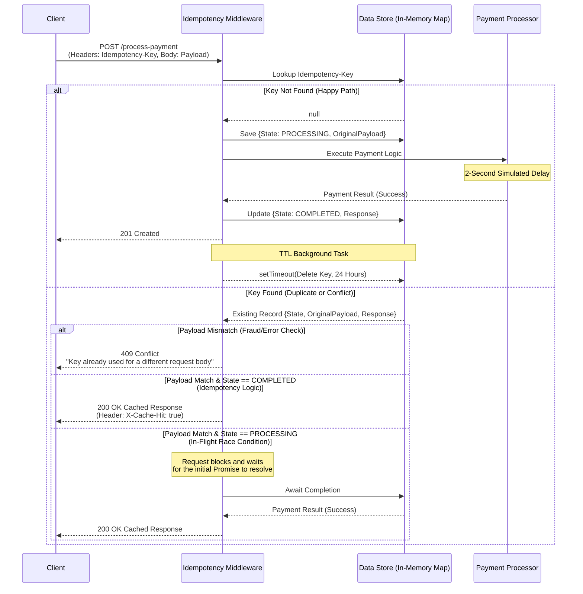

# Idempotent Payment Processing API

A  Node.js/Express REST API that safely processes payments while preventing accidental double-charges through idempotency keys and in-memory read-through caching.

## Architecture Diagram

This sequence diagram illustrates how the system handles pioneer requests, safe duplicates, and high-concurrency race conditions (in-flight requests).



## Setup Instructions

### Prerequisites
Before you begin, ensure you have **Node.js** and **npm** installed on your machine.

### Installation & Execution

1. **Clone the repository:**
   ```bash
   git clone https://github.com/housebuoy/Idempotency-Gateway.git

   cd Idempotency-Gateway
   ```

2. **Install the dependencies:**
   ```bash
   npm install
   ```

3. **Start the server:**
   ```bash
   npm start
   ```
The server will start and listen on http://localhost:3000 by default.


## API Documentation

### Process Payment
Processes a payment securely, guaranteeing that requests with the same
`Idempotency-Key` and body are only charged once.

* **URL:** `/process-payment`
* **Method:** `POST`
* **Headers:**
  * `Content-Type: application/json`
  * `Idempotency-Key: <unique-string>` **(Required)**

* **Request Body:**
```json
  {
    "amount": 250,
    "currency": "GHS"
  }
```

#### Responses

**`201 Created` — Payment processed (first request)**

Returned the first time a given `Idempotency-Key` is seen. The payment logic
runs (~2s simulated delay) before the response is returned.

```json
{
  "status": "Charged 250 GHS"
}
```

**`201 Created` — Replayed response (safe duplicate)**

Returned when the same `Idempotency-Key` arrives again with an **identical**
body. The payment logic does **not** run again; the original response is
replayed instantly. Distinguished only by the `X-Cache-Hit` header.

*Response header:*
```
X-Cache-Hit: true
```

*Response body (identical to the original):*
```json
{
  "status": "Charged 250 GHS"
}
```

> **In-flight requests:** If a duplicate arrives while the first request is
> still processing, it blocks until the first one resolves, then receives this
> same replayed response — it never starts a second charge.

**`409 Conflict` — Key reused for a different body**

Returned when an existing `Idempotency-Key` is sent with a **different** request
body (e.g. the amount changed). Protects against accidental or malicious key
reuse.

```json
{
  "error": "Idempotency key already used for a different request body."
}
```

**`400 Bad Request` — Missing idempotency key**

Returned when the `Idempotency-Key` header is absent.

```json
{
  "error": "Idempotency key is required"
}
```


## Design Decisions

### Why an in-memory `Map`
The idempotency store is a native JavaScript `Map`. For the scope of this
challenge it gives O(1) lookups and inserts with zero external dependencies or
setup, so the server runs immediately after `npm install` — nothing to
provision, no connection strings. The tradeoff is deliberate and worth naming:
the store is process-local and non-persistent, so keys are lost on restart and
are not shared across multiple instances. In production this `Map` would be
swapped for **Redis**, which keeps the same key/value access pattern while
adding persistence, native TTL, and a store that every API instance can share
behind a load balancer.

### Why an `IN_FLIGHT` state with a pending promise
Each key is stored with an explicit state. Before the payment finishes, the
record is `IN_FLIGHT` and holds a reference to the in-progress `Promise`
(`pendingTask`). This is what lets a duplicate that arrives *mid-processing* do
the right thing: instead of starting a second charge (double-charge) or being
rejected with a premature `409`, it simply `await`s the same promise and
receives the original result once it resolves. Storing the work-in-progress —
not just the finished result — is what makes the in-flight / race-condition
story possible.

### Why no locks are needed — single-threaded atomicity
The race-condition safety relies on a property of Node's runtime rather than on
explicit locking. Node executes JavaScript on a single thread, and the event
loop can only switch to another task at an `await` (or other async) boundary.
In the request handler there is **no `await` between checking for the key and
claiming it**:

```js
if (idempotencyKeyStore.has(idempotencyKey)) { /* ...replay path... */ }

// no await anywhere in this window — runs atomically
const processingPromise = new Promise(/* ... */);
idempotencyKeyStore.set(idempotencyKey, {
  originalRequest: req.body,
  status: "IN_FLIGHT",
  pendingTask: processingPromise
});

const responseBody = await processingPromise; // first await is here
```

Because that check-then-set window contains no async boundary, the event loop
cannot interleave a second request into it. The first request of a concurrent
pair always wins the `set` and marks the key `IN_FLIGHT` before the second one
gets to run its `has()` check — so the second request reliably falls into the
in-flight branch and waits. This gives correct concurrency handling without
mutexes, queues, or any locking primitive.

## The Developer's Choice: 24-Hour Key Expiry (TTL)

**Feature:** Every idempotency key is automatically removed from the store 24
hours after it is created.

### Why I added it
The idempotency store is an in-memory `Map`, which means it has no natural
eviction — without cleanup it would grow for the entire lifetime of the
process, holding onto every key the server has ever seen. For a service that
sits in front of a payment processor and handles a high volume of requests,
that is a slow but certain memory leak. A bounded retention window keeps memory
usage proportional to *recent* traffic rather than *all-time* traffic.

The 24-hour window is a deliberate value, not an arbitrary one. It matches the
industry standard set by Stripe, whose saved idempotency results also expire
after 24 hours. That length is long enough to absorb every realistic retry
scenario — client-side timeouts, network blips, automatic retry queues, even a
client that retries minutes or hours later — while still being short enough to
release the key afterwards.

Expiry also protects a subtler case: idempotency keys are meant to identify a
*single* logical transaction. Once that transaction is well in the past, the
key should be free for reuse. Holding it forever would mean a client that
recycles key strings (a common pattern) could be permanently blocked from ever
running a new, legitimate transaction under an old key.

### Implementation
After a payment completes, a one-shot timer schedules the key's removal:

```js
setTimeout(() => {
  idempotencyKeyStore.delete(idempotencyKey);
  console.log(`Cleaned up key ${idempotencyKey} from memory.`);
}, 24 * 60 * 60 * 1000); // 24 hours
```

### Production note
Because the timer lives inside the Node process, expiry is reset if the server
restarts and is not shared across multiple instances — the same limitation as
the in-memory store itself. In production this responsibility would move to
**Redis**, using its native `EXPIRE` / TTL on each key. That hands eviction to
the datastore, survives restarts, and works consistently across every API
instance, while keeping the exact same 24-hour policy described here.


